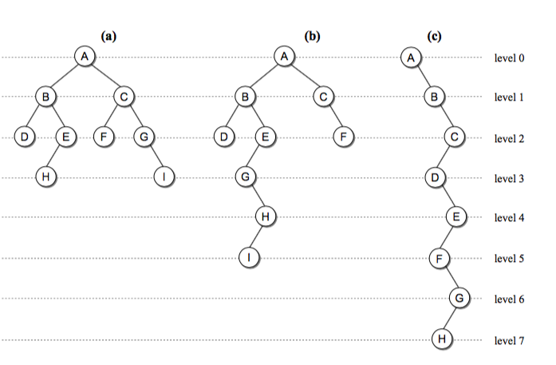

# Stack

A container of data, last in first out.

## Methods

* push: add an element to the top of the stack.
* pop: remove and return the element at the top.

## Implementation of a stack

See code for details.

## Application: function calls & stack overflow

The temporay variables of a function are stored in a stack.
If a recursive function has no exit point, you'll encounter the error.

# Queue

A container of data, first in first out.

## Methods

* enqueue: add an element in the end of the queue.
* dequeue: remove and return the first element of the queue.

## Implementation of a stack

See code for details.

## Challenge

Implement a queue with stacks.

## Priority Queue

Priority queue will not sort the elements with the order then entered the queue, but with some other order.

# Tree

Tree is a special case of graph. It is a directed graph with a root node.

Binary trees are a special type of trees, in which each node has at most two children.

To traverse a tree, use recursive algorithms.

## Application

Binary search tree