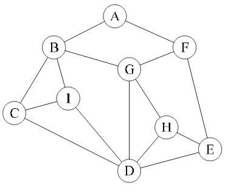

# Environment setup

Download processing from the [website](https://processing.org/download/).

# Graph Definition

```py
graph = {
    'A': ['B', 'F'],
    'B': ['C', 'I', 'G'],
    'C': ['B', 'I', 'D'],
    'D': ['C', 'I', 'G', 'H', 'E'],
    'E': ['D', 'H', 'F'],
    'F': ['A', 'G', 'E'],
    'G': ['B', 'F', 'H', 'D'],
    'H': ['G', 'D', 'E'],
    'I': ['B', 'C', 'D'],
}
```



# Search algorithms for a graph

```py
def SearchAlgorithm(start_node, end_node):
    # Init
    nodes_to_be_searched = [start_node]
    nodes_visited = []
    while len(nodes_to_be_searched) > 0:
        current_node <- nodes_to_be_searched.NextNode()
        if current_node == end_node:
            return Succeed
        else:
            nodes_visited.append(current_node)
            new_nodes_to_be_searched = GetUnvisitedNeighbors(current_node)
            nodes_to_be_searched.PushNodes(new_nodes_to_be_searched)
    return Failure
```

The tricky part: NextNode() and PushNodes().

## BFS

Visit nearby nodes first.

nodes_to_be_searched is a queue.

Generally will return an optimal solution.

## DFS

Visit furthest nodes first.

nodes_to_be_searched is a stack.

Generally explores fast.

## A*

Will define a heuristic value for every node.

nodes_to_be_searched is a priority queue, ordered by heuristic value.

## Greedy

An A* algorithm with a heuristic, that gives a higher priority for nodes which are closer to the target.